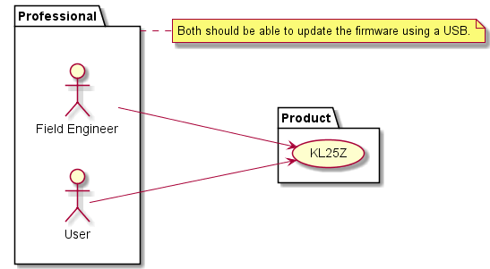
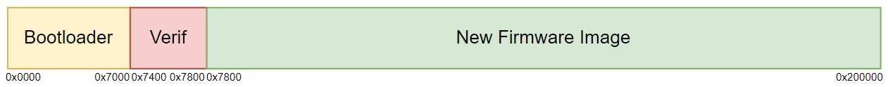
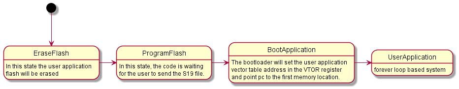

# PES-Final-Project
PES-Final-project for ECEN5813
Project for Principles of Embedded Software is Bootloader for KL25z.       
# Bootloader
This project aims at providing a feature that would eliminat the need for OpenSDA. This feature allows the field upgrade of the firmware to be made possible. In addition to the file upgrade tthe bootloader provides verifiction area and bootloader corruption memeory protection.

Use Case:   


Memory allocated:  


## Operational steps
The KL25Z boots into the bootlaoder mode after every reboot/boot. Bootloader provides an 4 option menu for the user to update th firmware.   
Description:   
1. `erase` : erase the new firmware flash location.    
2. `prog`: bootloader will be waiting for the new firmware file to be transferred.   
3. `boot`: the option will boot the fimrware present on the new firmware location.

To update the firmware:    
1. Boot/reboot the Kl25Z.   
2. Enter the erase command and hit enter.
3. Enter the Prog command and hit enter.
4. Teraterm: File->Send File, select the .s19 file and click open.
5. As soon as the xfer is complete the bootloader will booot the new firmware.



```NOTE:```   
After the .s19 is written, the bootloader will write the signature `0xAA55` to the verification memory location and boot the new firmware.
Next time the KL25Z is booted, the user enter the boot command, the bootloader will check to see if the verification section has the signature. If the signature is present, that implies the firmware file is present and the new firmware will be bootloaded. If this section wasn't present and the bootloader tried to boot the memory location 0x7800, if there was no firmware, there would be no mechanism for the system to be brought back into the bootloader mode and the user would have to restart the board.

Steps on generating the .s19 file:    
1. In MCUXpressor, go to project settings of the project whose bootloade firmware file you wish to generate.
2. Go to C/C++ Build->MCUSettings->Memory Details.
3. Change the Flash location from 0x0 to 0x7800.
4. Go to C/C++ Build->Settings->Build Steps->Post-build steps->Edit
5. Enter the command `arm-none-eabi-objcopy -v -O srec "${BuildArtifactFileName}" "${BuildArtifactFileBaseName}.s19"`
6. Hit apply and close.
7. Clean dn build the project.
8. Your .s19 file will be genertaed parallel to the .axf file.

When in bootloader normal mode, the Green LED flashes every 1 second.    
When in bootloader error mode, the Red LED flashes every 1 second.

## UART Config
The Bootloader updtaes the firmware over UART at the moment. The config for the UART is:   

1. Baud rate: 115200   
2. Parity : None   
3. Stop bits: 1   
4. Data bits: 8   

## Project Demo Video
https://drive.google.com/drive/folders/1KfMnmtVF3m_21R_sUNr1ZEWieYMg6LuU?usp=sharing
## Test Plan
Present in the attached excel file.
